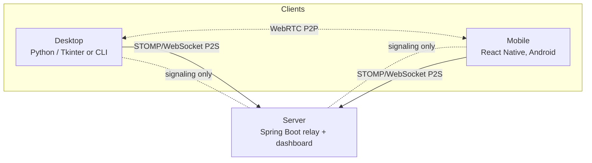
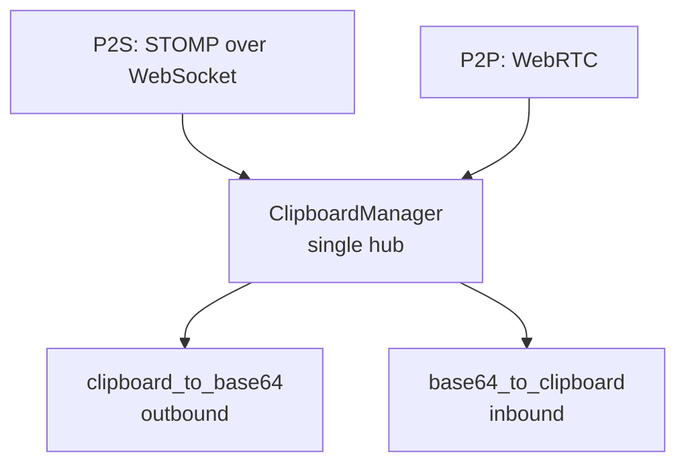

# ClipCascade — Architecture

## Big picture

Three independently deployable components, joined only by a shared wire protocol and a shared E2E crypto scheme. There is no shared build tooling or shared code between them.

- **Desktop** (`ClipCascade_Desktop/`): Python. Parallel Tkinter-GUI and terminal-CLI variants.
- **Server** (`ClipCascade_Server/ClipCascade_Backend/`): Spring Boot (Java 21) relay + static/Thymeleaf dashboard.
- **Mobile** (`ClipCascade_Mobile/src/`): React Native, Android only.

## The sync contract (spans all three components)

Every client — desktop, mobile, and the server's own dashboard JS — talks to the relay over STOMP with fixed destinations:

- `SUBSCRIBE /user/queue/cliptext` (receive)
- `SEND /app/cliptext` (send)

`StompDestinationAuthorizationInterceptor` (server) rejects any SUBSCRIBE/SEND to anything else — this is what keeps one user's clipboard isolated from another's.

**If you change the message shape, all three move together:**
- `ClipCascade_Desktop/src/stomp_ws/stomp_manager.py`
- `ClipCascade_Mobile/src/StartForegroundService.js`
- `ClipCascade_Server/.../resources/static/assets/js/main.js`

## Two transports per client

Both funnel into the same clipboard read/write surface:

- **P2S** — STOMP over WebSocket through the Spring server.
- **P2P** — direct device-to-device via `aiortc` (desktop) / `react-native-webrtc` (mobile); the server is used only for signaling (SDP offer/answer, ICE) through `P2PWebSocketHandler`.

Payloads are base64-encoded and optionally AES-GCM-encrypted before either transport sends them.

### P2P fragmentation

Large P2P payloads split into 15 KiB fragments. Reassembly must decode on UTF-8 codepoint boundaries and validate `totalFragments`/`index` before allocating. The logic is deliberately kept identical in:
- `ClipCascade_Desktop/src/core/fragment_utils.py`
- `ClipCascade_Mobile/src/fragmentUtils.js`

**Change both together.**

## E2E encryption

Desktop (`utils/cipher_manager.py`) and mobile (`App.js`) each independently derive the same AES-256 key:

- PBKDF2-HMAC-SHA256, **664,937 rounds**, salt = `username + password + salt`
- AES-256-GCM with a fresh random nonce per message

The derived key never leaves the device. The server only ever relays ciphertext — or plaintext if the user opts out of encryption.

## Desktop internals

### GUI vs CLI duplication

`gui/` (Tkinter — Windows/macOS/Linux-GUI) and `cli/` (terminal prompts — Linux-CLI, selected via `LINUX_USE_CLI_UI`) implement parallel versions of `tray.py`, `login.py`, `info.py`, `message_box.py`.

Known rough edge: `interfaces/ws_interface.py` is the seam meant to pick between them, but it imports `cli.tray` unconditionally regardless of which UI is active — the two trees are not cleanly separable yet.

### ClipboardManager — the single hub

`clipboard/clipboard_manager.py` is the one place both UIs and both transports call through for outbound (`clipboard_to_base64`) and inbound (`base64_to_clipboard`) clipboard events. Hook cross-cutting behavior here rather than duplicating per transport.

### Encrypted local history (in progress, not wired up)

`history/` (`crypto.py`, `store.py`, `service.py`, `retention.py`, `models.py`) is a self-contained, Windows-only encrypted-at-rest clipboard-history store:

- DPAPI-wrapped AES-256 master key
- Per-record AES-256-GCM with AAD binding
- Versioned SQLite schema

No Qt/PySide6 dependency; not yet called from `ClipboardManager`. Check module docstrings for current scope before assuming a capability exists.

`history_ui/` is a separate on-demand PySide6 child process (packaged only with `CLIPCASCADE_WITH_HISTORY_UI=1`) that will eventually read history over IPC — it never gets direct SQLite or key access.

## Server internals

### Fail-fast configuration

`ProductionConfigValidator` (an `EnvironmentPostProcessor`) refuses to start the Spring context when:

- `CC_ADMIN_USERNAME` / `CC_ADMIN_PASSWORD` / `CC_SERVER_DB_PASSWORD` are unset
- The external STOMP broker is enabled without distinct credentials
- `CC_ALLOWED_ORIGINS` is a wildcard

None of these have working defaults on purpose — don't add one "for local dev convenience."

### Dashboard — no build step

The web dashboard (`src/main/resources/templates/*.html` + `static/assets/js/main.js`) is server-rendered Thymeleaf plus plain jQuery. No npm/webpack pipeline; edits take effect on the next Spring restart.

### Other server pieces

- **`StompDestinationAuthorizationInterceptor`** — enforces the fixed destination allow-list.
- **`P2PWebSocketHandler`** — WebRTC signaling relay.
- **`IpAddressResolver` + `CC_TRUSTED_PROXIES`** — client-IP resolution for brute-force protection; `server.forward-headers-strategy` must stay `none` so clients can't spoof `X-Forwarded-For`.
- **Database** — H2 file mode with AES encryption by default; PostgreSQL via compose variant.

## Related docs

- [SETUP.md](SETUP.md) — installation and configuration
- [USAGE.md](USAGE.md) — operating ClipCascade
